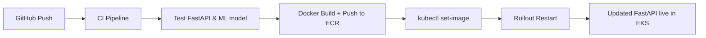

# Loan Recommendation Platform - GenAI Platform and Infrastructure Demo

This repository demonstrates a production-ready, cloud-native infrastructure and deployment pipeline for a Python-based machine learning API.

---

## Key Features

- **Containers and Kubernetes (EKS)**
  - Docker-based FastAPI application
  - CI/CD pipeline for ECR image builds and automatic deployment to **Amazon EKS**
  - GitHub Actions pipeline with Kubernetes `kubectl rollout` integration

- **Python API for Machine Learning**
  - `FastAPI` REST API for serving predictions
  - Model is trained with `scikit-learn` and saved using `joblib`
  - Two test cases with `pytest`, one for basic execution, one for ML training validation

- **Monitoring & Observability** *(extension-ready)*
  - Kubernetes-ready structure for integrating:
    - Prometheus + Grafana
    - AWS CloudWatch Logs
    - API readiness and liveness probes supported by FastAPI

- **MLOps Concepts**
  - `mlflow` integration ready in separate module (`loan-mlops-pipeline`)
  - Train, log, and register models for reproducible experiments

- **Terraform Setup** *(Optional)*
  - Infrastructure-as-Code module (`main.tf`) available but not required to run the project
  - EKS, VPC, IAM setup handled previously via Terraform for demo purposes

- **Data Engineering Ready** *(bonus)*
  - Modular structure supports feature extraction, model pipelines
  - ML model supports custom numeric features for loan data

---


## Setup Instructions

### Run Locally
```bash
pip install -r requirements.txt
uvicorn api.main:app --reload
```
Then visit: [http://127.0.0.1:8000/docs](http://127.0.0.1:8000/docs)

### Run Tests
```bash
pytest tests/
```

---

## Deployment

### CI/CD via GitHub Actions
- Commit to `main` branch triggers:
  - `ci.yml`: runs tests
  - `deploy.yml`: builds Docker image, pushes to ECR, updates EKS deployment

### EKS & Kubernetes
- Deployed to Amazon EKS (region: `eu-north-1`)
- Example public endpoint:
  ```
  http://<elb-url>/docs
  ```

### Secrets Required
Set the following GitHub secrets:
- `AWS_ACCESS_KEY_ID`
- `AWS_SECRET_ACCESS_KEY`

---

## Deployment Flow



---

## Ready to Extend

You can easily extend this project with:
- `mlflow` integration from [loan-mlops-pipeline](https://github.com/jaatinen/loan-mlops-pipeline)
- Monitoring tools like Prometheus/Grafana
- Terraform IaC workflows for full automation

---

## Author

Contact: GitHub [@jaatinen](https://github.com/jaatinen)

---

## Suitable for:

✅ EKS / Containers  
✅ Python API development  
✅ MLOps pipelines  
✅ Terraform-based environments  
✅ Financial industry use cases

---


